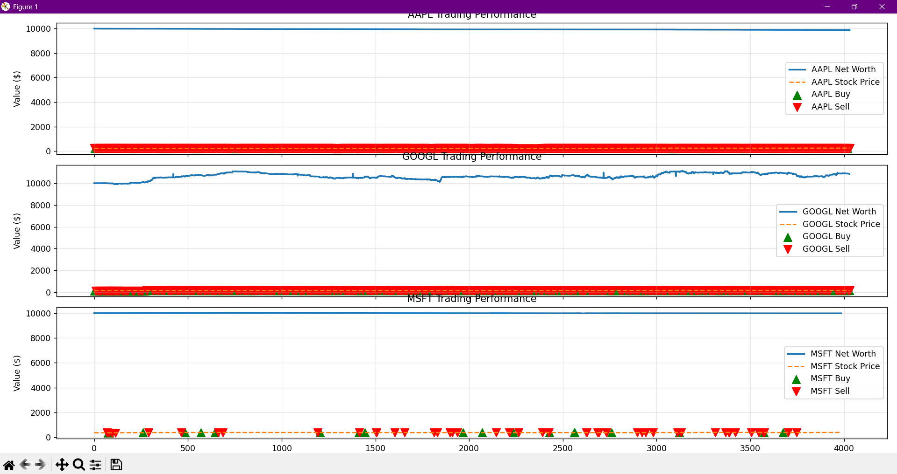

<!DOCTYPE html>
<html lang="en">
<head>
    <meta charset="UTF-8">
    <meta name="viewport" content="width=device-width, initial-scale=1.0">
</head>
<body>
    <h1 align="center">🤖 RL-Powered Algorithmic Trading Bot</h1>
    
  

        
    

    
  <h2>📊 Project Overview</h2>
    
   
This project implements a Reinforcement Learning (RL) based trading bot that autonomously learns optimal trading strategies for stocks. Using Proximal Policy Optimization (PPO) from Stable Baselines3, the bot analyzes historical stock data and technical indicators to make informed buy, hold, or sell decisions.

    
  <h2>🔍 What This Project Does</h2>
    
  <ol>
        <li><strong>Data Acquisition & Preprocessing</strong>: Fetches real-time stock data from Alpha Vantage API for multiple symbols (AAPL, GOOGL, MSFT).</li>
        <li><strong>Technical Analysis</strong>: Computes important trading indicators including:
            <ul>
                <li>Simple Moving Averages (10-day and 50-day)</li>
                <li>Relative Strength Index (RSI)</li>
                <li>Moving Average Convergence Divergence (MACD)</li>
            </ul>
        </li>
        <li><strong>Environment Simulation</strong>: Models a realistic trading environment with:
            <ul>
                <li>Transaction fees</li>
                <li>Balance tracking</li>
                <li>Portfolio valuation</li>
                <li>Reward mechanisms based on performance</li>
            </ul>
        </li>
        <li><strong>Model Training</strong>: Trains an RL agent for each stock to maximize returns using PPO algorithm.</li>
        <li><strong>Strategy Backtesting</strong>: Tests the trained models against historical data and visualizes performance metrics.</li>
        <li><strong>Performance Analysis</strong>: Compares the RL strategy against a simple buy-and-hold approach to measure effectiveness.</li>
    </ol>
    
  <h2>🌟 Benefits & Applications</h2>
    
   <ul>
        <li><strong>Automated Trading</strong>: Eliminates emotional biases in trading decisions through algorithmic execution.</li>
        <li><strong>Adaptive Strategies</strong>: Unlike traditional trading algorithms with fixed rules, the RL approach learns and adapts to changing market conditions.</li>
        <li><strong>Multi-Asset Support</strong>: Trains separate models for different stocks, recognizing the unique patterns and behaviors of each asset.</li>
        <li><strong>Risk Management</strong>: Incorporates transaction costs for realistic simulation and performance evaluation.</li>
        <li><strong>Performance Visualization</strong>: Provides comprehensive visualizations of trading decisions and portfolio performance over time.</li>
        <li><strong>Educational Value</strong>: Serves as a practical implementation of RL concepts in financial markets.</li>
    </ul>
    
  <h2>🛠️ Technologies Used</h2>
    
   <ul>
        <li><strong>Python</strong>: Core programming language</li>
        <li><strong>Gymnasium</strong>: For creating the custom trading environment</li>
        <li><strong>Stable Baselines3</strong>: Implementation of the PPO algorithm</li>
        <li><strong>Alpha Vantage API</strong>: Real-time and historical stock data</li>
        <li><strong>Pandas</strong>: Data manipulation and analysis</li>
        <li><strong>Matplotlib</strong>: Visualization of trading performance</li>
        <li><strong>NumPy</strong>: Numerical operations and array manipulation</li>
    </ul>
    
  <h2>🚀 Getting Started</h2>
    
   <pre><code>git clone https://github.com/username/rl-trading-bot.git
cd rl-trading-bot
pip install -r requirements.txt
python trading_bot.py</code></pre>
    
  <h2>⚠️ Disclaimer</h2>
    
  
This project is for educational and research purposes only. It is not financial advice, and the strategies implemented may not be profitable in live trading. Always conduct thorough research before applying algorithmic trading strategies with real capital.

</body>
</html>
